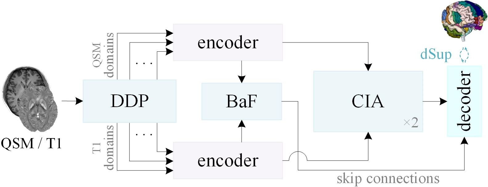

# CIA-Net: Common-individual attention network for interpretable brain region segmentation in biparametric MRI

## Overview
We provide the PyTorch implementation of our Pattern Recognition submission ["CIA-Net"](https://doi.org/10.1016/j.patcog.2026.114387).



## Usage

### Install requirements
pip install -r requirements.txt

### Sample set
The pre-trained model weights and sample data are available for download via [QuarkCloud](https://pan.quark.cn/s/4240d86c39db).

### Preprocess
```python
python execution/preprocess.py -r [CIA_raw folder] -p [CIA_processed folder] -D [dataset_ID] 
```

### Train   
```python
python execution/train.py -p [CIA_processed folder] -r [CIA_results folder] -f [fold] -D [dataset_ID] -t [task_name] -d [cpu|gpu_index]
```


### Predict
```python
python execution/predict.py -i [input_folder] -o [output_folder] -r [CIA_results folder] -D [dataset_ID] -t [task_name] -d [cpu|gpu_index]
```
